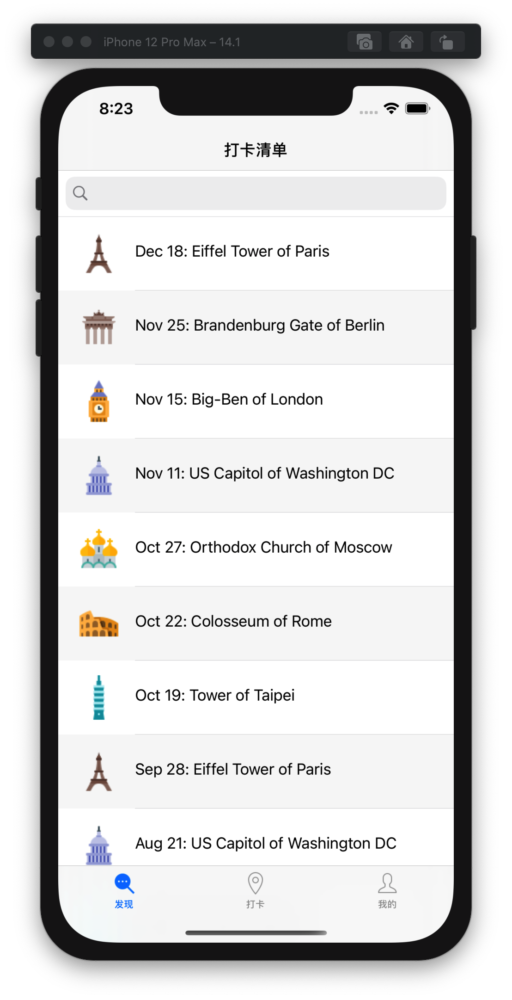
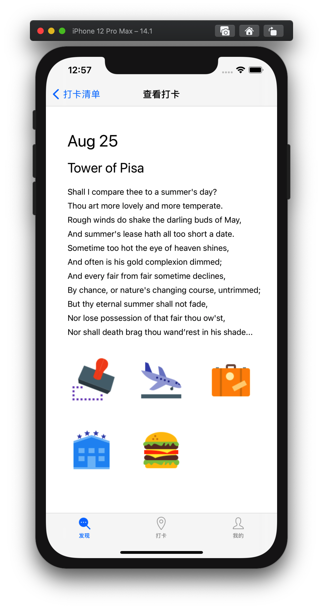
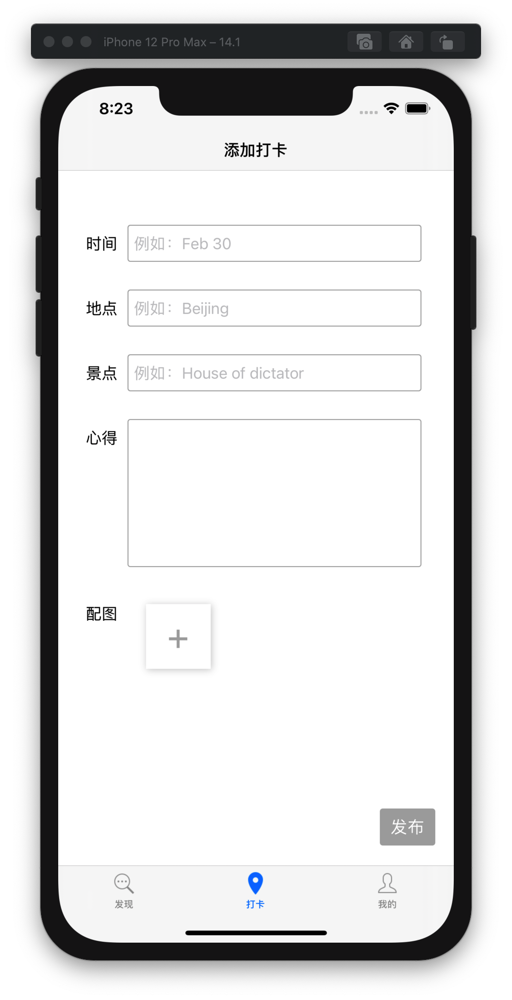
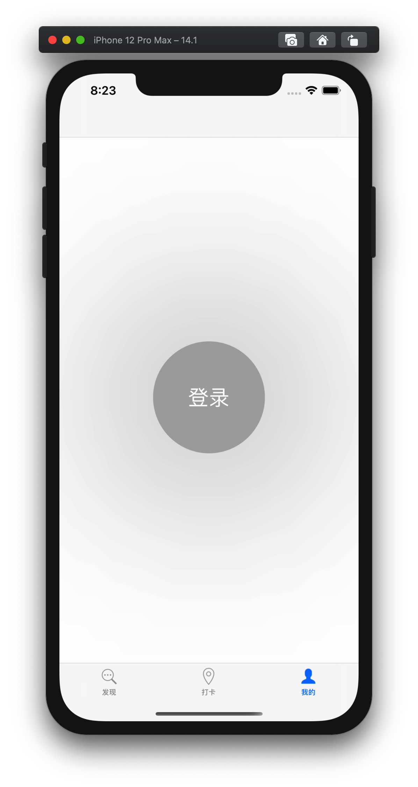
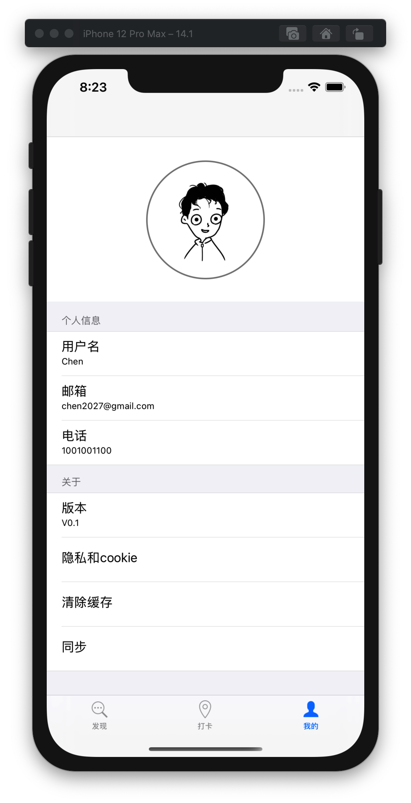

# HW2 


## 项目结构

```
.
|- AppDelegate.h
|- AppDelegate.m
|- Controllers
   |- TabBarController.h
   |- TabBarController.m
   |- FindViewController.h
   |- FindViewController.m
   |- InsertViewController.h
   |- InsertViewController.m
   |- LogInViewController.h
   |- LogInViewController.m
   |- DetailViewController.h
   |- DetailViewController.m
```

## AppDelegate 类

程序的入口，在此处实现了对根视图控制器的创建：

```oc
- (BOOL)application:(UIApplication *)application didFinishLaunchingWithOptions:(NSDictionary *)launchOptions {

    ...
    self.window = [[UIWindow alloc] initWithFrame:[[UIScreen mainScreen]bounds]];

    TabBarController *tbc = [[TabBarController alloc] init];
    
    self.window.rootViewController = tbc;
    
    [self.window makeKeyAndVisible];
    
    return YES;
}
```

同时由于程序的 AppDelegate 是一个单例模式的体现，本程序不同的界面通过共享的 AppDelegate 的实例变量传值，这些 AppDelegate 中的实例变量起了全局变量的作用。


```oc
// AppDelegate.h
@interface AppDelegate : UIResponder <UIApplicationDelegate>
@property (strong, nonatomic) UIWindow *window;
@property (nonatomic) NSMutableArray *items;
@end


@interface Item : NSObject
@property (nonatomic) NSString *date;
@property (nonatomic) NSString *location;
@property (nonatomic) NSString *spot;
@property (nonatomic) NSString *thoughts;
@property (nonatomic) NSMutableArray *pics;
@property (nonatomic) UIImage *displayedInFindView;

-(instancetype) initWithDate:(NSString*)date
                 andLocation:(NSString*)location
                     andSpot:(NSString*)spot
                 andThoughts:(NSString*)thoughts
                     andPics:(NSMutableArray*)pics
                     andIcon:(UIImage*)icon;
-(NSString*)getBriefInfo;
@end
```

其中的 items 实例变量即为本程序用到的共享数据变量。程序中任一视图控制器中都可以通过以下方式访问该变量:

```oc
AppDelegate *myDelegate = (AppDelegate*)[UIApplication sharedApplication].delegate;
NSMutableArray *myItems = myDelegate.items;
```

附加地，在 AppDelegate 类中做了数据的初始化，使程序一开始有一些初始记录。这些记录是随机生成的。

```oc
- (void)initializeData
{
   ...
}
```

AppDelegate 有一个实例方法用于将数据按时间倒序排列，以达到项目的一项要求。程序在初始化数据和插入数据后均会调用该方法，这能保证发现页面中的数据失踪有序。

```oc
-(void)sortItems;
```


## TabBarController 类

`TabBarController` 类继承 `UITabBarController` 类，实现的是本程序中屏幕下方的用于界面切换的 bar。  

程序在 AppDelegate.m 中已经创建了程序所需的唯一的 `TabBarController` 实例作为程序的根视图控制器。如果你不想你的程序的某些视图时不时地覆盖你的 `TabBarController`， 你最好也这么做。

在 `TabBarController` 的 `init` 函数中，我们将创建程序所需的三个界面的控制器，并**各自用`UINavigationController`装好**，将以三者为根界面控制器的三个 `UINavigationController` 父界面加入 `TabBarController` 的 `viewControllers` 中。

```oc
- (instancetype) init{
    if(self = [super init])
    {
        // Three subviews
        FindViewController *findVC = [[FindViewController alloc] init];
        UINavigationController *FindNav = [[UINavigationController alloc] initWithRootViewController:findVC];
        
        InsertViewController *insertVC =[[InsertViewController alloc] init];
        UINavigationController *InsertNav = [[UINavigationController alloc] initWithRootViewController:insertVC];
        
        LogInViewController *loginVC = [[LogInViewController alloc] init];
        UINavigationController *loginNav = [[UINavigationController alloc] initWithRootViewController:loginVC];
        
        self.viewControllers = @[FindNav, InsertNav, loginNav];
    }
    return self;
}
```

**Q**: 为什么加入的是以它们为根的 `UINavigationController` 父界面而不是它们本身？
**A**: 因为你需要 `UINavigationController` 来管理页面的跳转，每个 `UINavigationController` 通过维护一个栈的方式来管理页面的推入、返回等等事件。当你想在一个界面中跳转到一个界面，你需要调用 `[self.navigationController pushViewController:... animated:...]` 方法, 系统会搜索该界面的祖先，直到找到其中一个是 UINavigationController ，如果你不这么做，就找不到这样的祖先，该方法什么都不会做。

**Q**: 如果只需要它们的祖先有 `UINavigationController` ，那为什么要三个而不是一个（比如把 `TabBarController` 装进 `UINavigationController`）?
**A**: 我是这么实现的。我觉得直观上本程序的三个部分应该基本独立，使用不同的栈来管理各自的页面。你可以只用一个 `UINavigationController` , 程序的跳转可能会变得混乱且杂糅，你也可以用更多，但完全是多余的。


## `FindViewController` 类

本类实现了发现页面。  
发现页面由一个搜索框 (`UISearchBar`) 和一个 `UITableView` 组成。  



### 实现 `UITableView`

实现 UITableView 的关键是实现它的数据源和一些代理方法。以下是我的实现。

```oc
// 返回 section 的个数
- (NSInteger)numberOfSectionsInTableView:(UITableView *)tableView
{
    return 1;
}

// 返回每个 Section 中的 Cell 个数
- (NSInteger)tableView:(UITableView *)tableView numberOfRowsInSection:(NSInteger)section
{
    AppDelegate *myDelegate = (AppDelegate*)[UIApplication sharedApplication].delegate;
    return [myDelegate.items count];
}

- (UITableViewCell *)tableView:(UITableView *)tableView cellForRowAtIndexPath:(NSIndexPath *)indexPath
{
    AppDelegate *myDelegate = (AppDelegate*)[UIApplication sharedApplication].delegate;
    NSInteger i = indexPath.row;
    UITableViewCell *cell = [[UITableViewCell alloc] initWithStyle:UITableViewCellStyleSubtitle
                                                   reuseIdentifier:nil];
    cell.textLabel.text = [myDelegate.items[i] getBriefInfo];
    cell.imageView.image = [myDelegate.items[i] displayedInFindView];
    
    if(indexPath.row % 2 == 1)
    {
        cell.backgroundColor = [UIColor colorWithRed:0.97 green:0.97 blue:0.97 alpha:1.0];
    }
    
    return cell;
}

- (CGFloat)tableView:(UITableView *)tableView heightForRowAtIndexPath:(NSIndexPath *)indexPath
{
    return 80;
}

- (void)tableView:(UITableView *)tableView didSelectRowAtIndexPath:(NSIndexPath *)indexPath{
    NSInteger i = indexPath.row;
    DetailViewController *dvc = [[DetailViewController alloc] initWithIndex:(int)i];
    [self.navigationController pushViewController:dvc animated:YES];
}

// 动画和边框
- (void)tableView:(UITableView *)tableView willDisplayCell:(UITableViewCell *)cell forRowAtIndexPath:(NSIndexPath *)indexPath
{

    // 一开始比较小
    cell.layer.transform = CATransform3DMakeScale(0.4, 0.4, 1);

    // 动画时间为0.5秒,缩放回正常大小
    [UIView animateWithDuration:0.5 animations:^{cell.layer.transform = CATransform3DMakeScale(1, 1, 1);}];


    // 边框
    [cell.contentView.layer setBorderColor:[UIColor lightGrayColor].CGColor];
    [cell.contentView.layer setBorderWidth:0.5];
    cell.contentView.layer.cornerRadius = 10;
    cell.contentView.layer.masksToBounds = YES;
}

```


### 搜索框的代理

我将 UISearchBar 的代理设为该类，在类中实现了这些方法：

```oc
// 按下搜索时
- (void)searchBarSearchButtonClicked:(UISearchBar *)searchBar
{
    NSString *input = [searchBar text];
    AppDelegate *myDelegate = (AppDelegate *)[UIApplication sharedApplication].delegate;
    NSInteger n = [myDelegate.items count];
    for(int i = 0; i < n; i++)
    {
        NSString *brief = [[myDelegate.items objectAtIndex:i] getBriefInfo];
        if([brief rangeOfString:input].location != NSNotFound)
        {
            [self foundAt:i withBrief:brief];
            return;
        }
    }
    [self NotFoundAlert];
}

// 用到的辅助方法
- (void)foundAt:(int)i withBrief:(NSString *)brief 
{
    ...
}

- (void)NotFoundAlert 
{
    ...
}
```

## `DetailViewController` 类

本类实现的是打卡详情页面。  



该类主要需要解决的问题是数据传送的问题，这里用**构造函数传值**的方法解决了问题。  

当在发现页面中点击一个 Cell, 就会调用以下方法，构建一个详情页面并跳转至该页面。而构造详情页面时传入了该 Cell 的 index 作为 `DetailViewController` 的初始化函数的参数：

```oc
// from FindViewController.m
// line 184
- (void)tableView:(UITableView *)tableView didSelectRowAtIndexPath:(NSIndexPath *)indexPath{
    NSInteger i = indexPath.row;
    DetailViewController *dvc = [[DetailViewController alloc] initWithIndex:(int)i];
    [self.navigationController pushViewController:dvc animated:YES];
}
```

`DetailViewController` 接收到该参数，从数据源中拉取对应的数据，动态地生成一个详情页面：

```oc

- (instancetype)initWithIndex:(int)i
{
    self = [super init];
    self.view.backgroundColor = [UIColor whiteColor];
    
    int w = self.view.bounds.size.width;
    int h = self.view.bounds.size.height;
    
    AppDelegate *myDelegate = (AppDelegate*)[UIApplication sharedApplication].delegate;
    Item *thisItem = [myDelegate.items objectAtIndex:i];
    
    // 上半部分，文字view
    _textView = [[UIView alloc] initWithFrame:CGRectMake(40, 120, w - 60, h / 2 - 30)];
    UILabel *myDate = [[UILabel alloc]initWithFrame:CGRectMake(0, 10, w - 60, 50)];
    UILabel *myLocation = [[UILabel alloc]initWithFrame:CGRectMake(0, 60, w - 60, 50)];
    UILabel *myThoughts = [[UILabel alloc]initWithFrame:CGRectMake(0, 120, w - 60, h / 2 - 140)];
    myDate.text = [thisItem date];
    myDate.font = [UIFont systemFontOfSize:30];
    myLocation.text = [NSString stringWithFormat:@"%@ of %@",[thisItem spot], [thisItem location]];
    myLocation.font = [UIFont systemFontOfSize:25];
    myThoughts.text = [thisItem thoughts];
    myThoughts.font = [UIFont systemFontOfSize:15];
    myThoughts.numberOfLines = 22;
    [self setLineSpace:8.0f withText:[thisItem thoughts] inLabel:myThoughts];
    [myThoughts sizeToFit];
    
    [_textView addSubview:myDate];
    [_textView addSubview:myLocation];
    [_textView addSubview:myThoughts];
    [self.view addSubview:_textView];
    
    // 下半部分，图片view
    int a = 40; // 图片间隔
    int d = (w - 4 * a) / 3; // 图片边长
    _picView = [[UIView alloc]initWithFrame:CGRectMake(a, h / 2 + 90, w - 2 * a, h / 2 - 110)];
    NSArray *picFrames = @[[NSValue valueWithCGRect:CGRectMake(0, 0, d, d)],
                   [NSValue valueWithCGRect:CGRectMake(a + d, 0, d, d)],
                   [NSValue valueWithCGRect:CGRectMake(2*(a+d), 0, d, d)],
                   [NSValue valueWithCGRect:CGRectMake(0, a + d, d, d)],
                   [NSValue valueWithCGRect:CGRectMake(a+d, a + d, d, d)],
                   [NSValue valueWithCGRect:CGRectMake(2*(a+d), a + d, d, d)]];
    
    for(int j = 0; j < [thisItem.pics count]; j++)
    {
        UIImageView *imv = [[UIImageView alloc] initWithFrame:[[picFrames objectAtIndex:j] CGRectValue]];
        imv.image = [thisItem.pics objectAtIndex:j];
        [_picView addSubview:imv];
    }
    //_picView.backgroundColor = [UIColor blueColor];
    [self.view addSubview:_picView];
    
    return self;
}
```

## `InsertViewController` 类

本类实现的是打卡页面。  



打卡页面包含以下控件：

- 5 个 UILabel , 对应 5 个 title
- 3 个 UITextField 用于单行输入
- 1 个 UITextView 用于多行输入
- 1 个 配图的界面，其中包含
    - 1 个 会随着插入图片移动的添加图片的 UIButton
    - 动态生成最多5个 UIImageView ，对应 5 张选择的图片
- 1 个 发布 UIButton

### 实现 `UIImagePickerControllerDelegate`

一个 `UIImagePickerController` 可以提供选择图片的功能，我在添加图片的按钮上绑定了以下方法：

```oc
-(void)choosePic
{
    // 设置弹出的 actionSheet
    UIAlertController *actionSheet = [UIAlertController alertControllerWithTitle:nil message:nil preferredStyle:UIAlertControllerStyleActionSheet];
    
    
    UIAlertAction *photoAction = [UIAlertAction actionWithTitle:@"从相册选择" style:UIAlertActionStyleDefault handler:^(UIAlertAction * _Nonnull action) {
        self.imagePicker.sourceType = UIImagePickerControllerSourceTypePhotoLibrary;
        [self presentViewController:self.imagePicker animated:YES completion:nil];
    }];
    
    UIAlertAction *cancelAction = [UIAlertAction actionWithTitle:@"取消"
                                                           style:UIAlertActionStyleCancel
                                                         handler:nil];
    
    [actionSheet addAction:photoAction];
    [actionSheet addAction:cancelAction];
    
    [self presentViewController:actionSheet animated:YES completion:nil];
}
```

点击该按钮后会弹出包含 `从相机选择` 选项和 `取消` 选项的 actionSheet. 至于选择好的图片将如何处理，还需要实现以下代理方法。

```oc
// 对选中图片的处理
-(void)imagePickerController:(UIImagePickerController *)picker didFinishPickingMediaWithInfo:(NSDictionary<UIImagePickerControllerInfoKey,id> *)info
{
    [picker dismissViewControllerAnimated:YES completion:nil];
    
    // selectedImage 即为选中的照片
    UIImage *selectedImage = [info objectForKey:UIImagePickerControllerOriginalImage];
    NSInteger n = [_picCache count];
    if(n < 5)
    {
        UIImageView *newPicView = [[UIImageView alloc]initWithFrame:[[_picFrames objectAtIndex:n]CGRectValue]];
        newPicView.image = selectedImage;
        [_picView addSubview:newPicView];
        _addImageButton.frame = [[_picFrames objectAtIndex: n + 1]CGRectValue];
        [_picCache addObject:selectedImage];
    }
}
```
图片将被展示在打卡页面上，同时会被缓存，以便发布时一次性存入共享数据。


## `LogInViewController` 类

`LogInViewController` 类实现的是"我的"页面，该页面并无特别的知识点。



我实现该界面的方法是当点击按钮后直接清空整个页面的控件，用以下这条危险的语句：

```oc
// 清除子控件
[self.view.subviews makeObjectsPerformSelector:@selector(removeFromSuperview)];
```

然后从新绘制登录后的界面。



