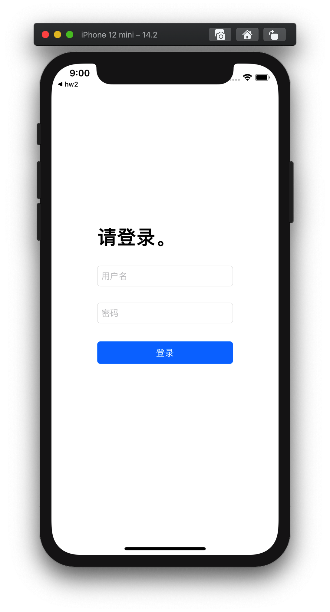
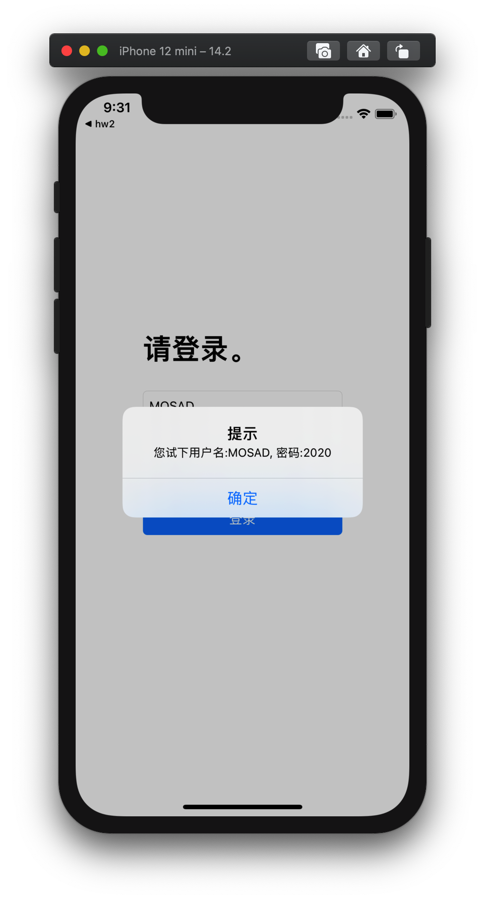
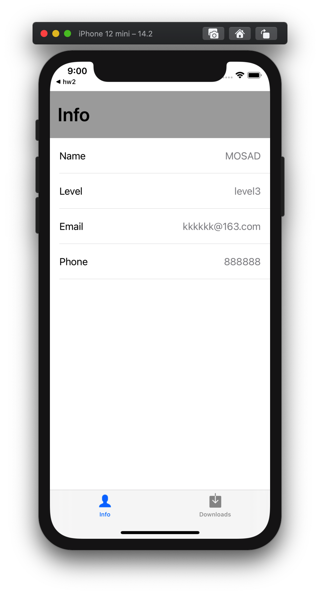
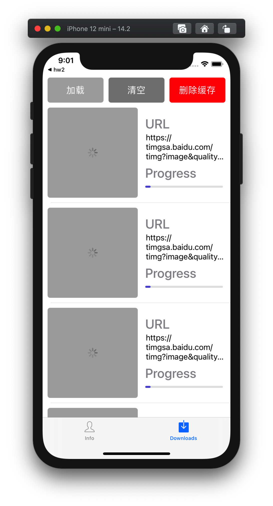
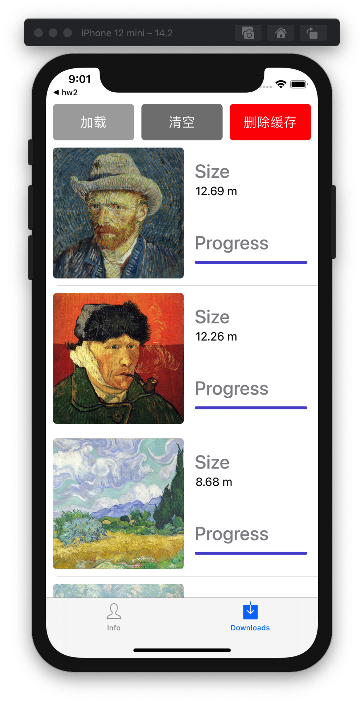
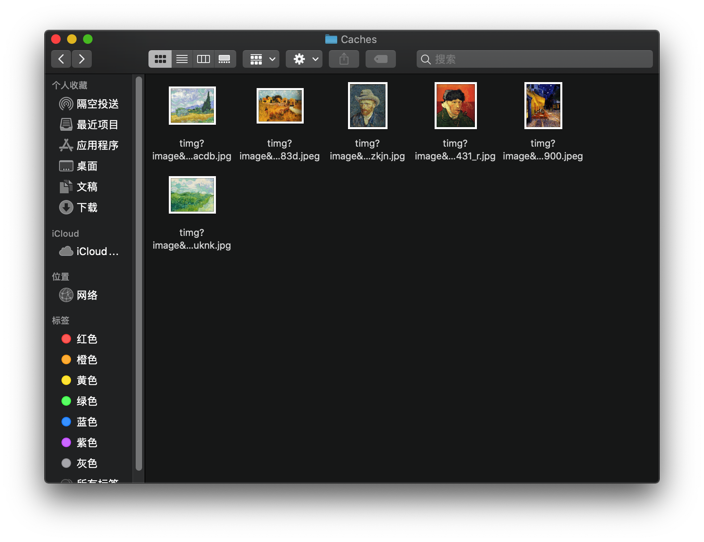
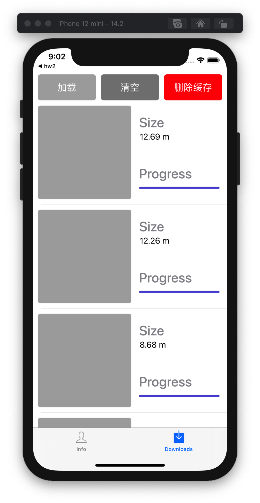
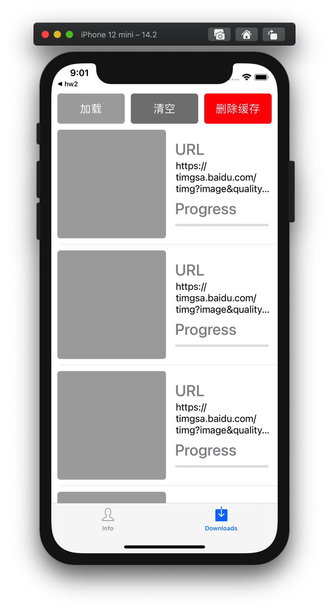

# HW3 - 网络访问和本地存储

**作业要求：** [requirements](https://gitee.com/chenguofan1999/mosad_-hw3)

## 我的程序

### 登录界面 & 个人信息

在校园网环境下使用用户名 *MOSAD* ，密码 *2020* 登录。

| 登录界面                                | 登录失败                                 | 个人信息                               |
| --------------------------------------- | ---------------------------------------- | -------------------------------------- |
|  |  |  |

### 图片浏览界面

#### 加载

|                  加载中                   |                 加载完成                 | 沙盒内缓存                              |
| :---------------------------------------: | :--------------------------------------: | --------------------------------------- |
|  |  |  |

#### 清空

**清空后点击加载**：立即加载出图片

| 清空前                                   | 清空后                                       | 再次点击加载                             |
| ---------------------------------------- | -------------------------------------------- | ---------------------------------------- |
|  |  |  |

#### 删除缓存

**删除后点击加载：**需要加载 

| 删除缓存前                               | 删除缓存后                                    | 再次点击加载                              |
| ---------------------------------------- | --------------------------------------------- | ----------------------------------------- |
|  |  |  |

