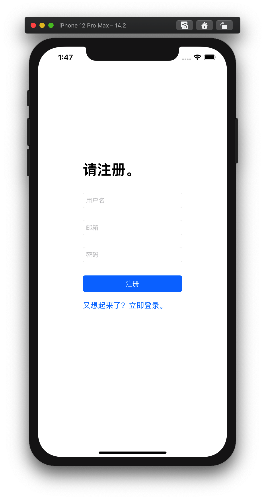

# IOS项目: 校园社交App


## 程序运行截图

### 登录界面


### 注册界面



### "我的"界面


### 个人界面


### 创作界面


### 广场


### 个人中心


# 实现时解决的一些问题


## 问题1: 使用 AFNetworking 做网络请求很难实现同步

### 分析

理解了 AFNetworking 的特性即为异步请求，打消了基于它做同步请求的念头。

### 解决方案

对于AFNetworking 的异步特性导致的类似于**拉取数据后，还未得到数据就执行加载 tableView 得到空 tableView** 的问题，将一定要在请求成功**之后**执行的语句放在 AFNetworking 的 success block 里执行。(解决了先后问题，但也同时带来了一定的性能问题，可以说没有利用好异步特性)


## 问题2:   TableViewCell 出现了数据重复、样式异常的情况

### 分析

这是因为 TableViewCell 的重用机制。

### 解决方案

摸索得到可行的解决方案：

1. 对于数据重复和一部分可逆的样式改变问题：每次获取重用的 cell 后要全面地重新赋值，务必覆盖所有可能遗留的样式和值。

2. 对于不可逆的样式改变：对样式不同的cell，可以使用不同的重用标识符以将两个复用池隔离。

   ```objc
   // 两个页面复用池分离！
       PostCell *cell = [tableView dequeueReusableCellWithIdentifier:[NSString stringWithFormat: @"PostCell%ld", _atPage]];
       if (cell == nil)
       {
           NSArray *topLevelObjects = [[NSBundle mainBundle] loadNibNamed:@"PostCell" owner:self options:nil];
           cell = [topLevelObjects objectAtIndex:0];
       }
   ```

   


## 问题3:   如何获取 button 所在的 Cell 的 indexpath

### 解决方案

1. 可通过给 button 加 tag (值为 cell 的足够标识 indexPath 的整数值)，

2. 也可以找到 button 的 supperView (contentView) 的 supperView 即为对应的 Cell 对象，再用indexPathForCell 方法得到 indexPath

   ```objc
   UIView *contentView = [btn superview];
   PostCell *cell = (PostCell *)[contentView superview];
   NSIndexPath *indexPath = [self.tableView indexPathForCell:cell];
   ```

   

## 问题4:   如何实现点击 Cell 中的 imageView 显示高清大图

### 分析

由于 UITableViewCell 是 View 而不是 ViewController，所以： 

1. 作为 MVC 中的 View 层，它**不应该**能直接访问图片.  
2. 作为 UIView 类，它也**做不到**直接控制视图切换，无论是 presentViewController 还是控制 Navigation Controller 都是 UIViewController 才拥有的方法。 

### 解决方案

一种实现方法是通过 Block 实现，Cell 拥有该 Block 变量，在 Cell 的实现中给ImagView 添加手势触发事件，事件即为执行该Block 。由控制该 Cell 的TableViewController 在 cellForRowAtIndexPath 方法中指定该 Block 的具体实现(点击弹出对应的大图的视图界面).

```objc
- (UITableViewCell *)tableView:(UITableView *)tableView cellForRowAtIndexPath:(NSIndexPath *)indexPath
{ 
  	PostCell *cell = [tableView dequeueReusableCellWithIdentifier:@"PostCell"];
  	//...
		// 设置Block（点击略缩图事件）
    cell.showImageBlock = ^(UIImage *img){
        BigImageViewController *bivc = [[BigImageViewController alloc] init];
        bivc.view.backgroundColor = [UIColor blackColor];
        bivc.image = img;
        [self presentViewController:bivc animated:YES completion:nil];
    };
  	//...
}
```


## 问题5:   如何简单地实现 reply 不同于 comment 的醒目样式。

### 分析

我的需求：不希望评论视图过于复杂，更不希望动态生成 reply View 影响性能。同时整体风格是扁平化的，效果要是优雅的。

### 解决方案

我的方案是

1. 设计表示 comment 和 reply 的两种 UITableViewCell 的子类，把它们都放在一个 UITableView 里。没错，一个 UITableView 里可以有多种 UITableViewCell 的子类。

2. 同时设计了一个 model 类 `CommentCellItem` 能同时表示两种内容，以便于统一数据源。

   ```objc
   - (UITableViewCell *)tableView:(UITableView *)tableView cellForRowAtIndexPath:(NSIndexPath *)indexPath
   {
       NSInteger i = indexPath.row;
       CommentCellItem *cellItem = _commentItems[i];
       
       UITableViewCell *cell = nil;
       
       if(cellItem.isReply)
       {
           ReplyCell *replyCell = [tableView dequeueReusableCellWithIdentifier:@"ReplyCell" forIndexPath:indexPath];
   				// 一系列的赋值操作
         	// ...
           cell = replyCell;
       }
       else
       {
           CommentCell *commentCell = [tableView dequeueReusableCellWithIdentifier:@"CommentCell" forIndexPath:indexPath];
           // 一系列的赋值操作
         	// ...
           cell = commentCell;
       }
       
       return cell;
   }
   ```


效果图：


## 问题6: 一条内容中不定数量的图片的显示


### 问题分析

在设计图片区域时，我脑中出现的问题是： 当图片数量从 0 到 无限张不等时，如何**优雅地**设计一个统一的图片区域呢？

### 解决方案

我的解决方案是用一个可横向滑动的 UIScrollView 来做图片区域，当图片增加，UIScrollView 的 contentSize 也随之动态地增加。下图中箭头所指的图片区域即为我的实现。遗憾的是往 Cell 中动态添加图片导致了一定程度的性能下降。


同样的解决方案被应用在了创作页面的图片区域:


这里没有性能的问题，呈现出的效果是优雅的。

## 问题7: 登录成功后如何直接跳转到 TabBarController

### 解决方法

一种应用于类似场景的直接跳转方法：直接修改主界面的 rootViewController .

**注意：从IOS13开始，找到主界面的操作更加复杂**

```objc
// 找到主界面，更改根vc
UIWindow* window = nil;
if (@available(iOS 13.0, *))
{
  for (UIWindowScene* windowScene in [UIApplication sharedApplication].connectedScenes)
    if (windowScene.activationState == UISceneActivationStateForegroundActive)
  {
    window = windowScene.windows.firstObject;
    break;
  }
}
else
{
  window = [UIApplication sharedApplication].keyWindow;
}
window.rootViewController = [[TabBarController alloc]init];
```


## 问题8: URL -> UIImage?

### 解决方法

```objc
UIImage *image = [UIImage imageWithData:[NSData dataWithContentsOfURL:[NSURL URLWithString:imageURL]]];
```


## 一点总结

这次的项目写了很久，本次项目有这些特点：

1. 最简实现。从 UI 设计到功能实现，尽量使用不复杂的实现方法，用尽量少的代码实现。
2. 未使用第三方 UI 库，使用 UIKit 从零实现各模块。
3. 将程序模块化，模块具有尽可能高的可复用性。

一些遗憾：

1. 没有用到 objective-C 的一些高级特性。
2. 没有实现一些现代应用里常见的 UI 模组，例如滑动分类标签、悬浮button、下拉刷新上拉加载。
3. 性能上有很大优化空间。同时比起在自己代码基础上缝缝补补，更希望能学习模仿各种常见模组实现的 Best Practice.